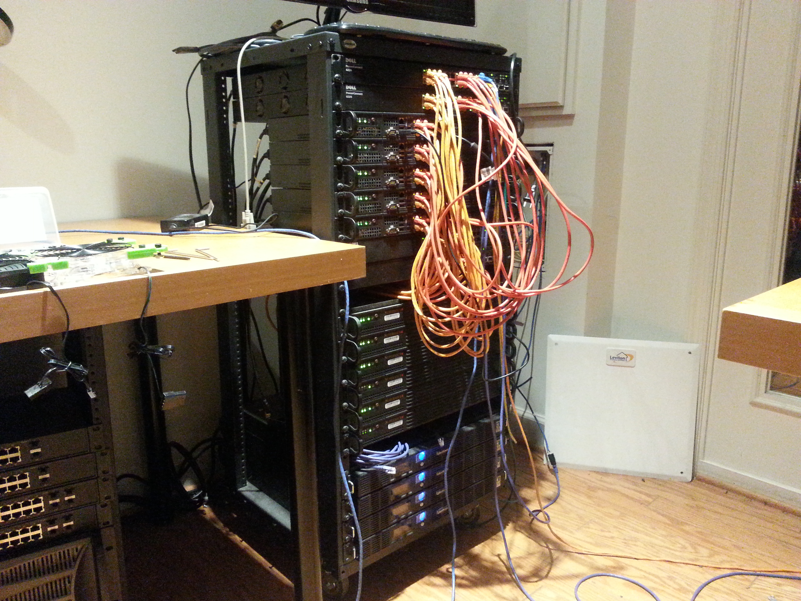

## Salt tools for bare-metal provisioning

Contents:
1. [Introduction](#introduction)
2. [Lab Infrastructure](#lab-infrastructure)
3. [Lab Setup](#labsetup)
4. [Useful Commands](#useful-commands)
5. [References](#references)


### Introduction

This is the reference setup I use in my home lab.  

SaltStack (Salt) is used in conjunction with PXE server/kickstart to install and provision multiple bare-metal machines running CentOS.  The machines designated as the Salt masters have the OS installed installed manually, and the Salt minions are installed via PXE/kickstart.  

Tested against salt 2015.5.10 (Lithium)

### Lab Infrastructure

- 3 [MintBox2](http://www.fit-pc.com/web/products/mintbox/mintbox-2/)
- 6 [Supermicro SYS-5018A-TN4](http://www.newegg.com/Product/Product.aspx?Item=N82E16816101836)
- 5 [Supermicro SYS-5108A-FTN4](http://www.newegg.com/Product/Product.aspx?Item=N82E16816101837)
- 4 [Dell Powerconnect 6224 L3 Switches](http://www.dell.com/us/business/p/powerconnect-6200-series/pd)



The MintBox2 machines are Salt masters running CentOS 7 with the MATE desktop.  They are also referred to as the **workstation** machines.  They are also the PXE servers, yum mirror, and NTP servers.

The Supermicros are Salt minions running CentOS 7.

##### Network infrastructure

On the Supermicro 5018-series hardware all 4 interfaces are bonded as bond0 using 802.3ad and LACP mode 4

View the pillar configuration here: [pillar/superlab.sls](pillar/superlab.sls)  

If you plan to fork the repository, unless you use the exact same hardware and IP addressing scheme you need to change the pillar and other network infrastructure files appropriately.  There should be no other hardcoded dependency changes to make.

### Lab Setup

1. [Install CentOS 7 on MintBox2](notes/centos-7-manual.md)
1. [Setup Salt Master and Minion on MintBox2](notes/setup-salt.md) 
1. [Setup Git and saltstack-base repository on MintBox2](notes/saltstack-base-setup.md)
1. [Run Initial Highstate](notes/highstate.md)
1. [Setup PXE Server on MintBox2](states/pxeserver/README.md)
1. [Install Supermicros (or other MintBox2) via PXE Server](notes/pxe-install.md)
1. [Run States on Minions](notes/run-states.md)

#### Assigning Roles to Machines

 ```bash
salt '<id>' grains.setvals "{'saltstack-base':{'role':'master'}}"
salt '<id>' grains.setvals "{'saltstack-base':{'role':'minion'}}"
```

### Useful Commands

Debug and output options:
- Local Version: `salt-run manage.versions`
- Output data using pprint: `salt 'store1' grains.items --output=pprint`
- Output data using json: `salt 'store1' grains.items --output=json`
- Debug level: `salt 'store1' --log-level=debug --state-output=mixed state.highstate test=True`
- Verbose: `salt -v --log-level=debug --state-output=mixed 'store1' state.highstate test=True`

Common commands:
- Run a command: `salt '*' cmd.run 'date'`
- Service restart: `salt '*' service.restart ntp`
- View a file: `salt '*' cp.get_file_str /etc/hosts`
- Look for a package: `salt 'store1' pkg.list_pkgs --output=json | grep ntp`
- Copy a file: `salt-cp '*' /local/file /remote/file`

State Execution:
- Force a pillar refresh:  `salt '*' saltutil.refresh_pillar`
- Sync all: `salt '*' saltutil.sync_all`
- Calling Highstate: `salt '*' state.highstate`

Jobs:
- Lookup result of a job: `salt-run jobs.lookup_jid 20150627120734094928`

Help:
- Show module docstrings: `salt 'store1' sys.doc test.ping`

[Salt Grains](notes/grains.md)

### References

- [Salt Module Index](http://docs.saltstack.com/en/latest/salt-modindex.html)

 
